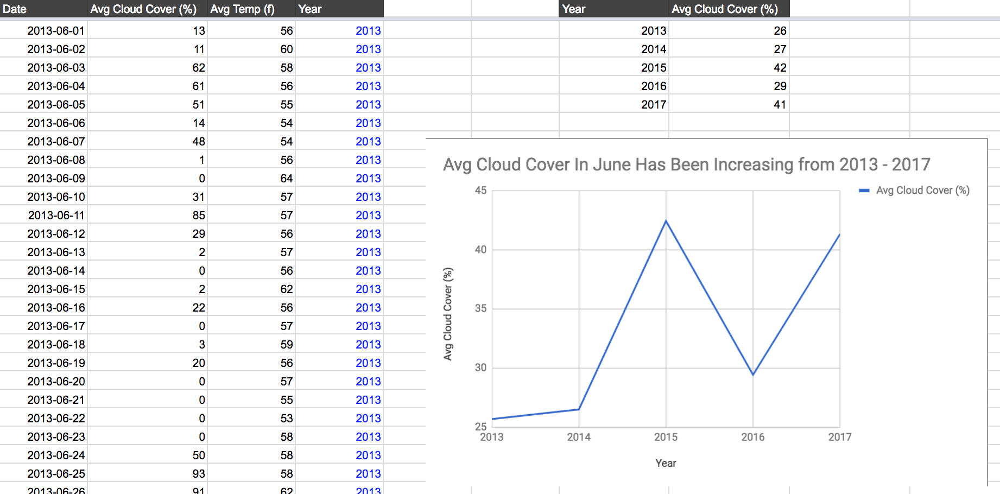

## platform-services-weather

> Is the weather getting 'better' or 'worse' over time?  

### Use case:  
  
A solar panel company in San Francisco wants to know if the historically gloomy month of June is getting 'better' or 'worse' over the last five years.
     
Solar panels lose approximately 30% of their efficiency in cloudy weather. Therefore, % cloudiness will be be the main determinate of weather improvement. 

## Methods:

Historical weather data was downloaded via the open weather map [history bulk data API](https://openweathermap.org/history-bulk). A bulk download of the past five years was available. The data contained hourly data from April 2012 - April 2018.


The hourly bulk data was consolidated into avg cloudiness per day. Daylight hours were only considered (7 am - 7pm). 

## Results:

The June forecast for solar panel efficiency in San Francisco appears to be getting worse over the past 5 years.



## Style:

The script followed the style used in the google sheets API docs. 

## Script Instructions:

Clone repo: 
```
git clone https://github.com/borerjason/platform-services-weather.git
```  
Create a .env file 
```
mkdir .env
```
Add the following lines to .env:
```
SPREADSHEET_ID=your-destination-google-spreadsheet-id
PORT=3000
```
Google sheets auth API setup:
* Follow Steps 1 & 2 from [google sheets documentation](https://developers.google.com/sheets/api/quickstart/nodejs#step_3_set_up_the_sample)


## Docker build

Build image:  
```
docker build -t weatherserver .
```
  
Spin up container:  
```
docker run -d -p 1000:3000 --rm weatherserver
```  

Stop container:  
```
docker stop <container-name>
```